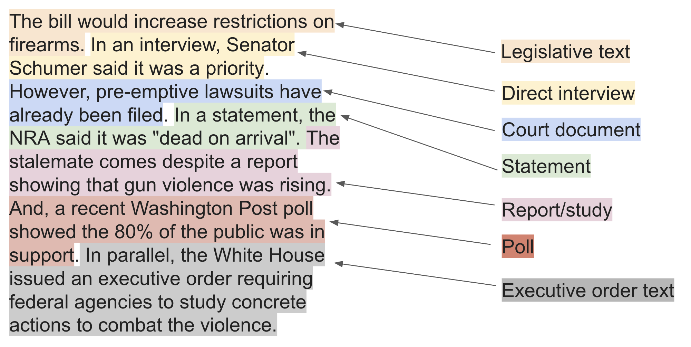

# source-exploration

This repository repository contains several components developed and maintained throughout research 
into the `source discovery` project, which was conducted at USC from January 2022-May 2022 and Bloomberg 
from May 2022-December 2022. Overall, the project seek develop systems to `detect`, `attribute` and 
ultimately `predict` quotes from information-sources used in journalistic news writing.

An information source is any source that is referenced by a journalist throughout the course of their reporting, and 
can include:
* Quotes from Named individuals
* Reports/Documents (e.g. legislative text, court cases, academic documents)
* Votes/Polls

See below for an example of the variety of different ways sources may be used in newswriting:



The aim of this work is multifold:

1. Detection: We wish to detect in each sentence whether a source is being referenced
2. Attribution: We wish to attribute each quote to an informational source.
3. Prediction: We wish to predict, in ablated documents, whether the document needs another source or not. 

This work does this by collecting annotations on existing news articles denoting whether the sentence is attributed
to a source, which source that is, as well as characteristics about the source. 

There are several distinct components in this repository. 

* `models_neural`: Transformer-based models to `detect` and `attribute` quotes that were developed at Bloomberg 
for the purpose of this project.
* `models_other`: Baseline models developed for this project as well as external academic models tested for this project
like a custom-designed topic-model (see: https://arxiv.org/pdf/2104.09656.pdf) for more details.
* `scripts`: Rule-based baselines developed and tested to detect and attribute sources.
* `app`: the flask/javascript application developed to annotate documents.  

In the following sections, we'll describe how to train the neural models.

## Training
 
 The training process is the same for both `detection` and `attribution`. We have several scripts that run 
 different specific models. If you are running the script on DSP, the flags should all have data and model files
 that are the appropriate ones for these experiments. In general, the data and model files that I used live in the 
 following s3 bucket:
 
 `s3://aspangher`
 
 The project-specific files, like the training data and test data, live in the following directory:
 
 `s3://aspangher/source-exploration/`
 
 and the general files, like Huggingface base models and Spacy models, live in subdirectories. But 
 the paths in the scripts are valid. 
 
 Also another general point is that, unless specified, the trained model will be uploaded to the 
 following directory: `s3://aspangher/source-exploration/./` with the model-name as the `--notes` flag. See end of this
 section for more information.  
 
###  `quote_detection`: 
 
 * `quote_detection/scripts/train.sh`: Runs training with the default setup: our annotated data and a roberta sentence-classification model.
To run training, you must have the following flags set:

```
        --pretrained_files_s3 <HUGGINGFACE_PRETRAINED_MODEL> \
        --train_data_file_s3 <INPUT_TRAINING_FILE> \
``` 
 
 * `quote_detection/scripts/train_polnear_data.sh`: Contains the same setup as the previous script, but for training with 
 the polnear dataset. 
 * `quote_detection/scripts/train_local.sh`: A convenient script for testing the training process locally.
 
### `quote_attribution`:
 
 * `quote_attribution/scripts/run_classification_script.sh`: Runs the classifier-based quote attributor.
 * `quote_attribution/scripts/run_span_detection_script.sh`: Runs the span-based quote attributor. 

For both of these scripts, they expect the following flags to be set:

```
        --pretrained_model_path <HUGGINGPACE_MODEL> \
        --train_data_file <TRAINING_DATA_FILE> \
        --spacy_model_file <SPACY_MODEL_FILE> \
```
 
### Model Locations 
 
 The default location for all project-independent resources (i.e. Spacy model files, Huggingface model files) is `s3://aspangher`. 
 Here you'll find the directories `s3://aspangher/transformer-pretrained-models/` (huggingface models) and 
 `s3://aspangher/spacy/` (spacy models).
 
 The default location for all project-specific resources is `s3://aspangher/source-exploration`. Here, you're find 
 training data, and previously trained models.
 
 All the data management is found in `models_neural/src/utils_data_access.py`. These methods are called by the various
 `train.py` methods. To change the default paths either pass in specific full paths or alter this file.
 
## Inference

`quote_detection`: 
 
 * `quote_detection/scripts/test.sh`: Runs inference. To work, you must have the following flags set:
 ```
        --pretrained_files_s3 <PRETRAINED_MODEL>
        --train_data_file_s3 <INPUT_DATA_FILE>
        --discriminator_path <TRAINED_MODEL_PATH>
        --processed_data_fname <OUTPUT_DATA_FILE> 
```

## Annotation Interface

Please obtain `data.zip` file from Alex. Unzip this and place it in the `app/data` directory, and then run `python main.py` 
from the `app/` directory. 

Direct your browser to `http://localhost:5002/render_table?task=affil-role` to begin annotating. 

Reach out to Alex for further instructions, assignments, etc.